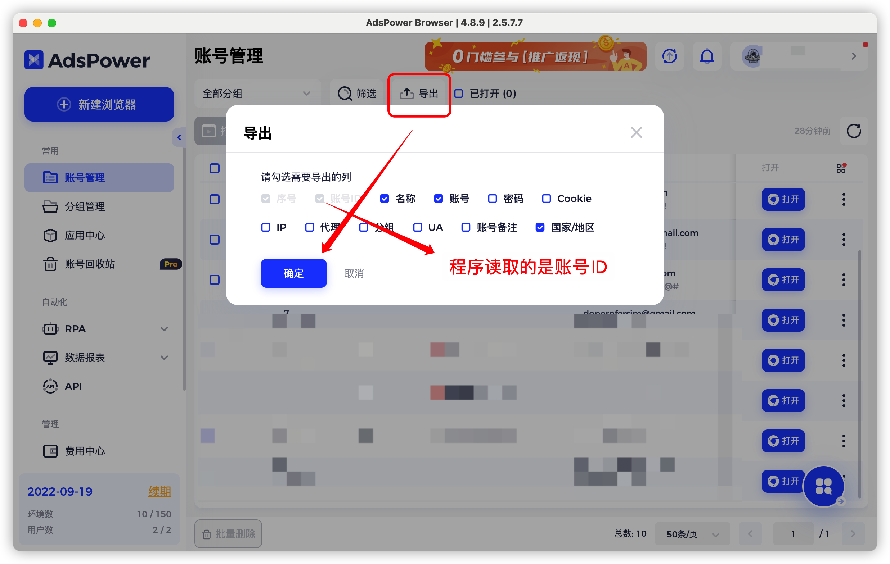

## 教程

网页版教程地址：
https://github.com/unlimitbladeworks/ads-auto

### 申请授权码

首先，软件需要进行授权才能使用，联系开发者进行购买(wechat@sudami15，备注ads)，并提供你电脑的mac地址。

如何查看自己电脑的mac地址详见：
https://net.sjtu.edu.cn/info/1212/2723.htm#:~:text=%E8%BE%93%E5%85%A5%E2%80%9Ccmd%E2%80%9D%EF%BC%8C%E7%82%B9%E5%87%BB%E7%A1%AE%E5%AE%9A,%E7%89%A9%E7%90%86%E5%9C%B0%E5%9D%80%EF%BC%88MAC%E5%9C%B0%E5%9D%80%EF%BC%89%E3%80%82

提供mac后，开发者会提供一个授权码，使用程序启动的时候，进行授权即可。

### auto-adspower

本工具是结合 adspower 指纹浏览器实现自动化的工具，意在自动化养号，撸毛等功能。

目前支持的功能

#### twitter 相关
- [x] twitter自动点赞
- [x] twitter自动转推
- [x] twitter自动关注

#### premint 相关
- [x] premint自动注册
- [x] premint查询中奖记录

### 目录


#### conf.ini

conf.ini 是工具的配置文件，可以用文本编辑器(记事本)打开，每行配置有详细的注释可供参考。

#### user_list.xlsx

通过 adspower 导出的 excel。
如图：

其中，该 excel 有一列 id 列，是 adspower 指纹浏览器的账号 id ，读取该列，是为了每次通过程序加载 id 对其进行浏览器的操作。

将文件名称改为：'user_list.xlsx'

#### twitter_url.xlsx


收录了区块链相关的知名作者，自动关注若开启，则会默认从中随机筛选进行账号关注


#### 生成 exe 脚本命令

```shell script
pyinstaller -F -i girl.ico ads-auto.py
```